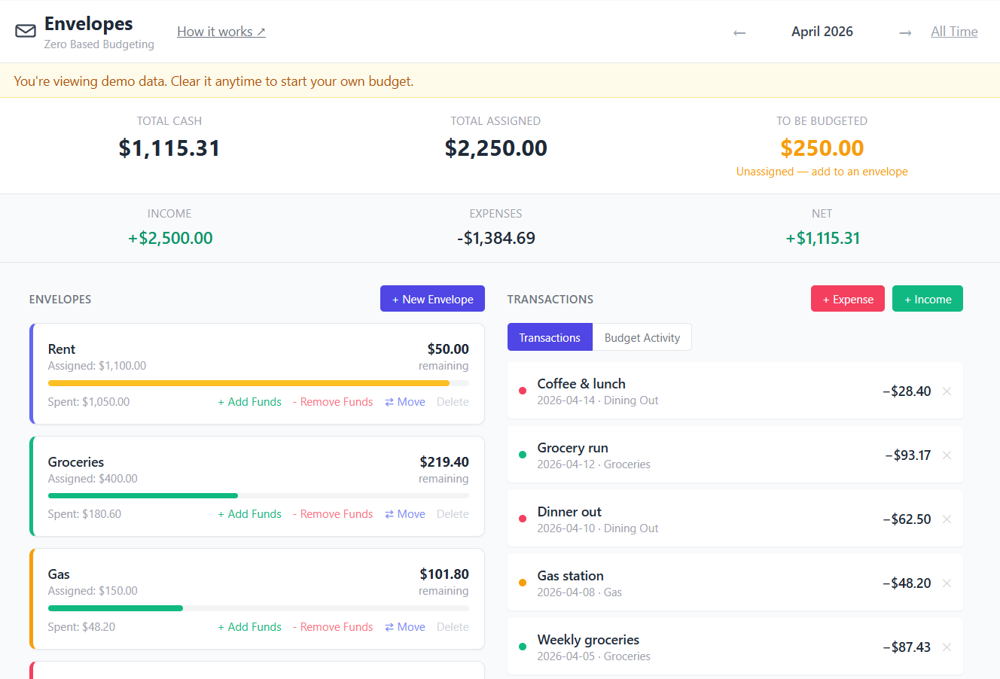

# Envelopes

> **If the envelope is empty, you’re done spending.**

**Try it live →** https://envelopes-app.com

A lightweight, local-first envelope budgeting app built around one idea:

👉 **Give every dollar a job — and know exactly what happened to it.**

Runs entirely in a single HTML file — no backend, no dependencies.

No accounts. No syncing. No subscriptions.  
Just a clear, predictable way to plan and track your money.

---

## Quick Start (30–60 seconds)

If the app looks empty — that’s normal. Start here:

1. **(Optional) Load demo data**  
   Click **Load Demo Data** to see how everything works.

2. **Add your cash (Income)**  
   Click **+ Income** and enter how much money you currently have.  
   This increases your **To Be Budgeted (TBB)**.

3. **Create your envelopes**  
   These are your categories (Rent, Food, Gas, etc.)

4. **Assign your money**  
   Allocate your TBB into envelopes until:
   👉 **TBB = $0.00**

5. **Start spending**  
   Click **+ Expense** and choose the envelope.

That’s it.

---

## Why this exists

Most budgeting apps try to do everything.

They connect to banks, auto-categorize transactions, and pile on features until you spend more time managing the app than your money.

This project takes the opposite approach:

- No automation you don’t control  
- No hidden rules  
- No guessing  

Just a simple system that makes your financial decisions visible.

---

## Who this is for

This is for people who:

- Want full control over their money
- Don’t trust bank integrations or aggregators
- Prefer clarity over automation
- Like envelope budgeting, but not the complexity of existing tools

If you’ve ever thought:

> “Why is budgeting software so complicated?”

You’ll probably like this.

---

## Overview

Envelope budgeting is a method where every dollar is assigned a purpose.

This app separates **planning** from **spending**:

- You assign money using envelopes (your plan)
- You record transactions (what actually happened)

Both stay visible — so you always know what you planned and what actually happened.

---

## How it works

1. **Add income**  
   Record money coming in. This increases your “To Be Budgeted” (TBB).  
   TBB represents money you’ve received but haven’t assigned to a purpose yet.

2. **Assign money to envelopes**  
   Give every dollar a job by assigning funds from TBB to envelopes.

3. **Spend from envelopes**  
   Record expenses against a category.

4. **Adjust your plan**  
   Move money between envelopes as needed.

---

## Key features

### Core budgeting

- Zero-based budgeting (ZBB)
- Envelope-based money allocation
- “To Be Budgeted” (TBB) tracking
- Move funds between envelopes (no fake transactions)

### Clarity & visibility

- Real-time summary:
  - Total Cash (all-time reality)
  - Total Assigned (your plan)
  - To Be Budgeted
- Month-based view for:
  - Envelope spending
  - Transactions
- Toggle for all-time view

### Tracking & history

- Transaction history (income + expenses)
- Budget activity log:
  - Assignments
  - Removals
  - Transfers between envelopes

### Data control

- Runs entirely in the browser (no backend)
- Data stored in `localStorage`
- Export to JSON (full backup)
- Import from JSON
- Export to CSV (filtered data for analysis)

### Usability

- Drag-and-drop envelope reordering
- Click-to-filter transactions by envelope
- Clear overspending indicators (negative balances + visual warning)
- Simple UI — no setup required

---

## How time works

- Month navigation affects:
  - Envelope spending
  - Transaction view

- Top-level numbers are always **all-time**:
  - Total Cash
  - Total Assigned
  - To Be Budgeted

This keeps your plan stable while letting you view spending over time.

---

## Why this is different

Most apps try to automate budgeting.

This one makes it explicit.

You decide:

- where money goes
- what gets priority
- how to adjust when things change

Nothing is hidden. Nothing is inferred.

---

## Running the app

1. Download `index.html`
2. Open it in your browser

That’s it.

No install. No build. No dependencies.

---

## Data storage

All data is stored locally in your browser using `localStorage`.

Important:

- Clearing browser data will erase everything
- Use **Export JSON** to create backups
- Use **Import JSON** to restore your data

---

## Current limitations

- No cloud sync or multi-device support
- Data is tied to a single browser
- No recurring or scheduled budgets (yet)
- No authentication

---

## Future improvements

- Better mobile layout
- Smarter guidance when overspending
- Per-envelope breakdown views
- Budget history by month
- Optional sync (without compromising simplicity)

---

## Development approach

This project is being built using a combination of:

- ChatGPT (architecture, design, reasoning)
- Claude Code (implementation)

See `DESIGN.md` for build philosophy and decisions.

---

## License

MIT License