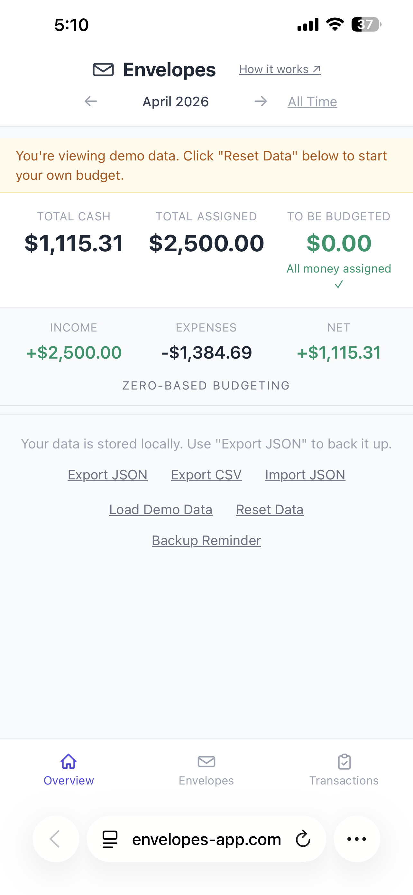
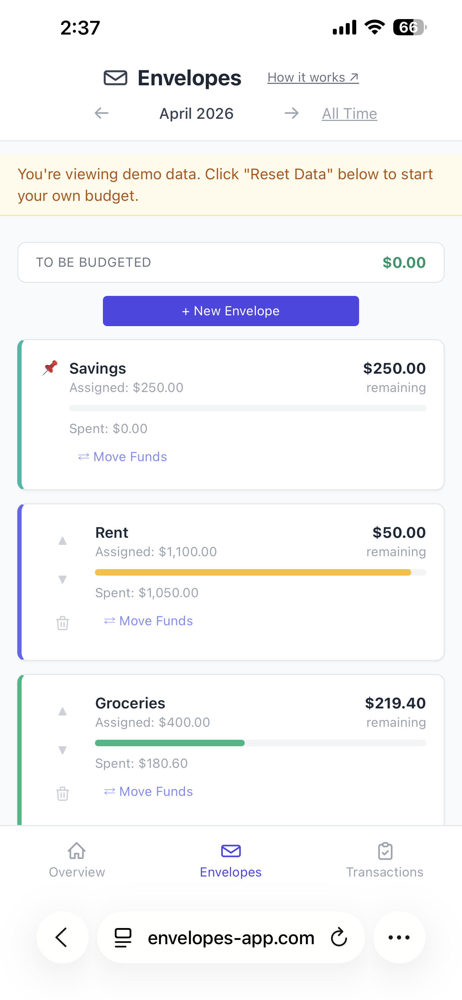
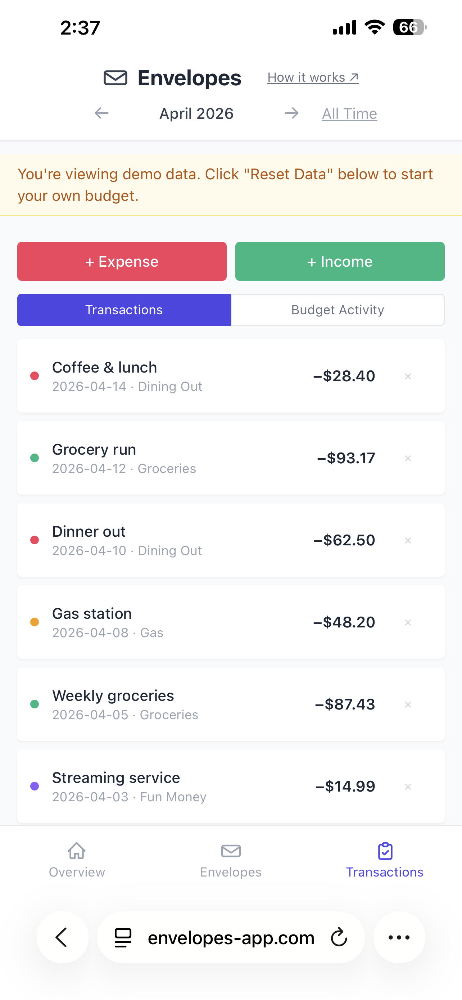

# Envelopes

> **If the envelope is empty, you’re done spending.**

**Try it live →** https://envelopes-app.com

A lightweight, local-first envelope budgeting app built around one idea:

👉 **Give every dollar a job — and know exactly what happened to it.**

Runs entirely in the browser — no backend, no dependencies.

No accounts. No syncing. No subscriptions.  
Just a clear, predictable way to plan and track your money.

---

## 📱 Works on mobile too — no install, no app store.

<table>
  <tr>
    <td align="center"> Overview</td>
    <td align="center"> Envelopes</td>
    <td align="center"> Transactions</td>
  </tr>
</table>

---

## Using the app

Open it here:

👉 https://envelopes-app.com

No account. No install. No setup.

Everything runs locally in your browser — your data never leaves your device.

---

## Quick Start

### Step 1 — Explore with demo data

Before setting up anything real, load the demo data to see how the app works.

Click **Load Demo Data** at the bottom of the page (or on the Overview tab on mobile).

You’ll see a working budget with envelopes, transactions, and a Savings balance — all pre-filled. Poke around. Move money between envelopes. Add a fake expense. Get comfortable.

### Step 2 — Reset when you’re ready

Once you’ve seen enough, wipe the demo and start fresh.

Click **Reset Data**. This clears everything and leaves you with a blank Savings envelope.

### Step 3 — Create your envelopes

These are your spending categories. Click **+ New Envelope** and name them.

Common starting points: Rent, Groceries, Gas, Utilities, Insurance, Emergency Fund.

#### Step 3b — Envelope design is personal

> Your envelope setup should reflect how **you** think about money — not a template someone else designed.

There’s no single right way to do this. A simplified setup might only have envelopes for Savings, Car Insurance, Utilities, Groceries, and Petty Cash — with fun money and gas folded into Petty Cash rather than getting their own envelopes. Someone else might want separate Entertainment and Fuel envelopes for more granular tracking.

Neither is wrong.

Start simple. You can always add more envelopes later. Fewer envelopes means less friction — and you’ll actually use the app.

### Step 4 — Add your income

Click **+ Income** and enter how much money you currently have. This increases your **To Be Budgeted (TBB)**.

If you’re mid-month, just enter your current bank balance. Don’t overthink it.

### Step 5 — Assign money to envelopes

Click **Add Funds** on each envelope and distribute your TBB until:

👉 **TBB = $0.00**

Every dollar should have a job. That’s the whole system.

### Step 6 — Start spending

Click **+ Expense**, choose the right envelope, and record what you spent.

That’s it.

---

## Reducing Transaction Clutter (Advanced)

Over time, your transaction history can get large and noisy.

If you prefer a clean slate while keeping your current financial state:

### Option: Reset history but keep balances

1. **Export your data (JSON)**
2. Re-import using:
   - **Envelopes + balances only**

This will:

- Keep all envelope names
- Keep current balances
- Remove all historical transactions

👉 Think of it as a "soft reset" of your history.

This is useful if:

- You don’t care about old transactions
- You want a cleaner interface
- You’re starting a new phase (new job, move, retirement, etc.)

---

## Why this exists

Most budgeting apps try to do everything.

They connect to banks, auto-categorize transactions, and pile on features until you spend more time managing the app than your money.

This project takes the opposite approach:

- No automation you don’t control  
- No hidden rules  
- No guessing  

Just a simple system that makes your financial decisions visible.

---

## Who this is for

This is for people who:

- Want full control over their money
- Don’t trust bank integrations or aggregators
- Prefer clarity over automation
- Like envelope budgeting, but not the complexity of existing tools

If you’ve ever thought:

> “Why is budgeting software so complicated?”

You’ll probably like this.

---

## Overview

Envelope budgeting is a method where every dollar is assigned a purpose.

This app separates **planning** from **spending**:

- You assign money using envelopes (your plan)
- You record transactions (what actually happened)

Both stay visible — so you always know what you planned and what actually happened.

---

## How it works

1. **Add income**  
   Record money coming in. This increases your “To Be Budgeted” (TBB).  
   TBB represents money you’ve received but haven’t assigned to a purpose yet.

2. **Assign money to envelopes**  
   Give every dollar a job by assigning funds from TBB to envelopes.

3. **Spend from envelopes**  
   Record expenses against a category.

4. **Adjust your plan**  
   Move money between envelopes as needed.

---

## Key features

### Core budgeting

- Zero-based budgeting (ZBB)
- Envelope-based money allocation
- “To Be Budgeted” (TBB) tracking
- Move funds between envelopes (no fake transactions)
- Built-in **Savings envelope** (pinned and always at the top)

### Savings tracking

- Dedicated Savings envelope (pinned)
- Balance-over-time graph
- Optional goal line for visual progress
- Tracks only assigned/removed funds (not income)

### Clarity & visibility

- Real-time summary:
  - Total Cash (all-time reality)
  - Total Assigned (your plan)
  - To Be Budgeted
- Month-based view for:
  - Envelope spending
  - Transactions
- Toggle for all-time view

### Tracking & history

- Transaction history (income + expenses)
- Budget activity log:
  - Assignments
  - Removals
  - Transfers between envelopes

### Data control

- Runs entirely in the browser (no backend)
- Data stored in `localStorage`
- Export to JSON (full backup)
- Import from JSON:
  - Full restore
  - Envelopes only
  - Envelopes + balances
- Export to CSV (filtered data for analysis)
- Configurable backup reminder (choose 7, 14, or 30-day intervals)

---

## How time works

- Month navigation affects:
  - Envelope spending
  - Transaction view

- Top-level numbers are always **all-time**:
  - Total Cash
  - Total Assigned
  - To Be Budgeted

This keeps your plan stable while letting you view spending over time.

---

## Why this is different

Most apps try to automate budgeting.

This one makes it explicit.

You decide:

- where money goes
- what gets priority
- how to adjust when things change

Nothing is hidden. Nothing is inferred.

---

## Data storage

All data is stored locally in your browser using `localStorage`.

Important:

- Clearing browser data will erase everything
- Use **Export JSON** to create backups
- Use **Import JSON** to restore your data
- Backup reminder settings persist across data resets

---

## Current limitations

- No cloud sync or multi-device support
- Data is tied to a single browser
- No recurring or scheduled budgets (yet)
- No authentication

---

## Development approach

This project is being built using:

- Claude (claude.ai) — architecture, design, reasoning, and prompting strategy
- Claude Code — implementation

See `DESIGN.md` for build philosophy and decisions.

---

## License

MIT License